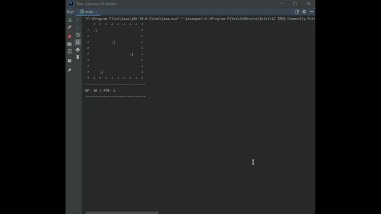

# Humans-VS-Goblins

Players can move north/south/east/west on a grid
and encounter goblins. Once they encounter 
mobs they can either fight or run away. Combat 
has a random chance to decrease or increase the damage output
by the human.

## Demo

## Authors

- [@StevenLof777](https://github.com/StevenLof777)